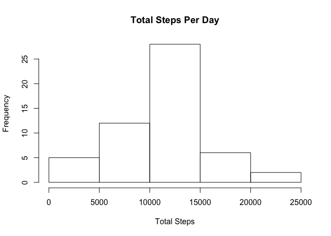
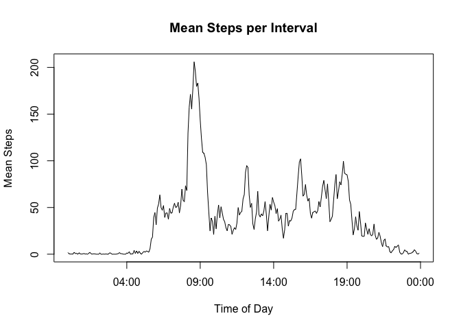
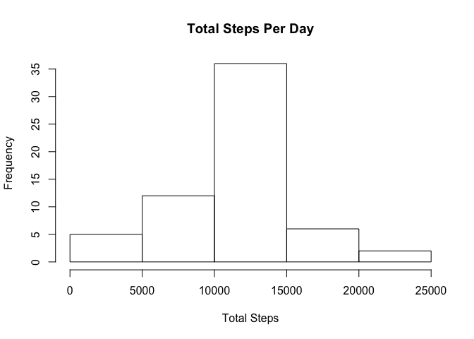

## Loading and preprocessing the data

```r
unzip("activity.zip")
activity_data <- read.csv("activity.csv")
activity_data$date <- as.Date(activity_data$date)
hour <- activity_data$interval %/% 100
minute <- activity_data$interval %% 100
timeOfDay <- paste(hour, minute, sep=":")
activity_data$interval <- as.POSIXct(timeOfDay, format="%H:%M")
```

## What is mean total number of steps taken per day?

```r
library(dplyr)
```

```
## 
## Attaching package: 'dplyr'
```

```
## The following objects are masked from 'package:stats':
## 
##     filter, lag
```

```
## The following objects are masked from 'package:base':
## 
##     intersect, setdiff, setequal, union
```

```r
total_steps_per_day <- group_by(activity_data, date) %>%
  filter(!is.na(steps)) %>%
  summarise(total=sum(steps))
# histogram of total steps
hist(total_steps_per_day$total, main="Total Steps Per Day", xlab="Total Steps", ylab="Frequency")
```

<!-- -->

```r
# mean and median total steps taken per day
mean_steps <- mean(total_steps_per_day$total)
median_steps <- median(total_steps_per_day$total)
```
The mean number of steps taken per day is 10766.19 and the median number of steps taken per day is 10765

## What is the average daily activity pattern?


```r
mean_steps_per_interval <- group_by(activity_data, interval) %>%
  filter(!is.na(steps)) %>%
  summarise(mean_steps=mean(steps))
with(mean_steps_per_interval, 
     plot(interval, mean_steps, type='l', main='Mean Steps per Interval', xlab="Time of Day", ylab="Mean Steps"))
```

<!-- -->

The 5-minute interval that contains the most steps, on average, is 08:35

## Imputing missing values

```r
num_missing <- sum(is.na(activity_data$steps))
# If an interval has missing steps data, use the average number of steps for that interval for imputation
activity_data$steps[is.na(activity_data$steps)] <- sapply(activity_data$interval[is.na(activity_data$steps)],
                                                          function(x_interval) 
                                                            { with(mean_steps_per_interval,
                                                                   mean_steps[interval==x_interval])})
total_steps_per_day <- group_by(activity_data, date) %>%
  filter(!is.na(steps)) %>%
  summarise(total=sum(steps))
# histogram of total steps
hist(total_steps_per_day$total, main="Total Steps Per Day", xlab="Total Steps", ylab="Frequency")
```

<!-- -->

```r
# mean and median total steps taken per day
mean_steps <- mean(total_steps_per_day$total)
median_steps <- median(total_steps_per_day$total)
```

The number of missing values in the dataset is 2304. The mean number of steps taken each day is 10766.19. The median number of steps taken each day is 10766.19.

## Are there differences in activity patterns between weekdays and weekends?
